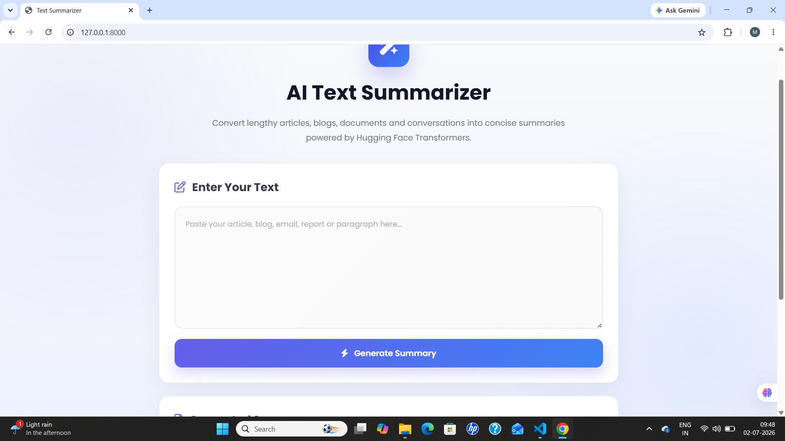
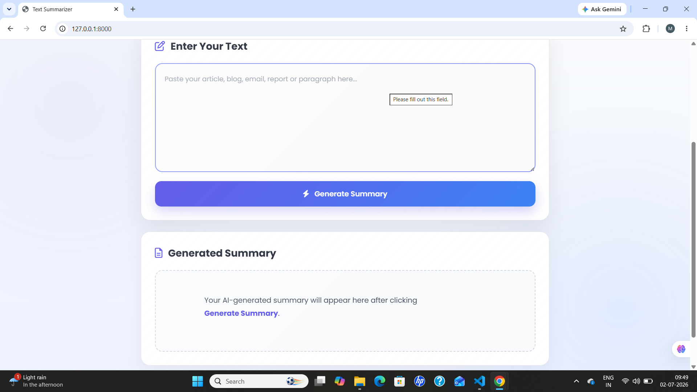

# 🧠 AI Text Summarizer using Fine-Tuned T5 Transformer

An AI-powered text summarization web application built using a **fine-tuned T5-small Transformer model**, **FastAPI**, and a responsive **HTML/CSS/JavaScript** frontend. The model was trained on the **SAMSum dataset** to generate concise, medium-length summaries from conversational text.

## 📖 Project Overview

This project demonstrates an end-to-end Natural Language Processing (NLP) workflow, from training a Transformer model to integrating it into a web application for real-time text summarization.

Users can enter text through a simple web interface, and the application generates an abstractive summary using a fine-tuned T5 model.

## 📸 Project Screenshots

### Home Page



### Generated Summary




## 🎥 Project Demo

A short demonstration video of the application is included in this repository (or linked here if hosted externally).

## ✨ Features

- 📝 Enter text through a user-friendly interface
- 🤖 Generate AI-powered abstractive summaries
- ⚡ FastAPI backend for efficient inference
- 🎨 Responsive frontend built with HTML, CSS, and JavaScript
- 📄 Medium-length summary generation
- 🔄 Real-time interaction between frontend and backend

## 🧠 Model Details

| Component | Details |
|-----------|---------|
| Model | T5-small |
| Architecture | Transformer |
| Framework | Hugging Face Transformers |
| Deep Learning Library | PyTorch |
| Dataset | SAMSum |
| Task | Abstractive Text Summarization |
| Training | Fine-tuned from a pretrained T5-small model |


## 📊 Dataset

This project uses the **SAMSum Dataset**, a conversational summarization dataset consisting of messenger-style conversations paired with human-written summaries.

The dataset was used to fine-tune the T5-small model for generating coherent and meaningful summaries.


## 🛠️ Tech Stack

- Python
- FastAPI
- Hugging Face Transformers
- PyTorch
- HTML5
- CSS3
- JavaScript


## 📁 Project Structure

AI-Text-Summarizer/
│
├── app.py
├── requirements.txt
├── README.md
├── .gitignore
│
├── saved_summary_model/
│   └── README.md
│
├── static/
│   ├── style.css
│   └── script.js
│
├── templates/
│   └── index.html
│
├── home-page.png
├── summary-page.png
└── demo.mp4 (optional)
```

## ⚠️ Important Note

The trained model files are **not included** in this repository because they exceed GitHub's file size limit.

To run this project locally, place your trained model files inside:
saved_summary_model/


## 🚀 Getting Started

### 1️⃣ Clone the Repository

```bash
git clone https://github.com/Minkal24/AI-Text-Summarizer.git
cd AI-Text-Summarizer
```

### 2️⃣ Create a Virtual Environment (Optional)

**Windows**

```bash
python -m venv venv
venv\Scripts\activate
```

### 3️⃣ Install Dependencies

```bash
pip install -r requirements.txt
```

### 4️⃣ Run the Application

```bash
uvicorn app:app --reload
```

### 5️⃣ Open Your Browser

```
http://127.0.0.1:8000
```

---

## 📚 Learning Outcomes

Through this project, I gained hands-on experience with:

- Transformer-based Natural Language Processing
- Fine-tuning Hugging Face T5 models
- Working with the SAMSum dataset
- Building REST APIs using FastAPI
- Integrating AI models with a web frontend
- Deploying an end-to-end machine learning application

## 🚀 Future Improvements

- Deploy the application online
- Support PDF and TXT file summarization
- Add adjustable summary length
- Improve UI/UX
- Add user authentication
- Support multiple summarization models

## 👩‍💻 Author

**Minkal**

If you found this project helpful or interesting, consider giving it a ⭐ on GitHub!
